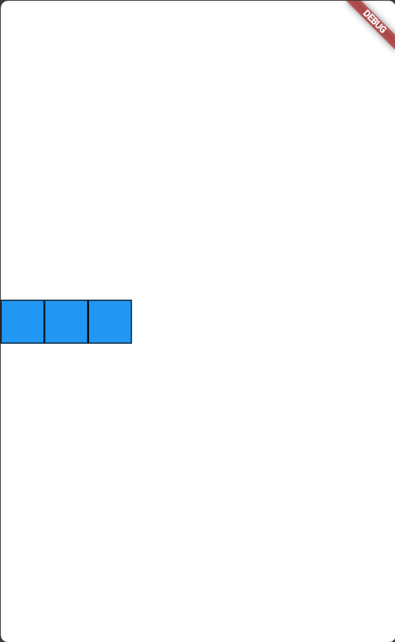

# UTS/TESYA ERIANA/2141720024/28

# Praktikum 4
https://github.com/tesyaeriana/pemrograman_mobile/tree/1f36722dc44433c1d44865a9e54614483204d9ae/Layout%20dan%20Navigasi/layout_dan_navigasi 
# Tugas Praktikum 1
1. Selesaikan Praktikum 1 sampai 4, lalu dokumentasikan dan push ke repository Anda berupa screenshot setiap hasil pekerjaan beserta penjelasannya di file README.md! 
Selesai.
2. Silakan implementasikan di project baru "basic_layout_flutter" dengan mengakses sumber ini: https://docs.flutter.dev/codelabs/layout-basics

## Row and Column Classes
```
import 'dart:async';
import 'package:flutter/material.dart';
import 'package:flutter_test/flutter_test.dart';

class MyRowColumn extends StatelessWidget {
  const MyRowColumn({super.key});

  @override
  Widget build(BuildContext context) {
    return Row(
      children: [
        BlueBox(),
        BlueBox(),
        BlueBox(),
      ],
    );
  }
}

class BlueBox extends StatelessWidget {
  @override
  Widget build(BuildContext context) {
    return Container(
      width: 50,
      height: 50,
      decoration: BoxDecoration(
        color: Colors.blue,
        border: Border.all(),
      ),
    );
  }
}
```
Output :

## Axis size and alignment
### mainAxisSize property
```
import 'dart:async';
import 'package:flutter/material.dart';
import 'package:flutter_test/flutter_test.dart';

class MyWidget extends StatelessWidget {
  @override
  Widget build(BuildContext context) {
    return Row(
      mainAxisSize: MainAxisSize.max,
      children: [
        BlueBox(),
        BlueBox(),
        BlueBox(),
      ],
    );
  }
}

class BlueBox extends StatelessWidget {
  @override
  Widget build(BuildContext context) {
    return Container(
      width: 50,
      height: 50,
      decoration: BoxDecoration(
        color: Colors.blue,
        border: Border.all(),
      ),
    );
  }
}

```
output:

### mainAxisAlignment property
```
import 'dart:async';
import 'package:flutter/material.dart';
import 'package:flutter_test/flutter_test.dart';

class MyWidget extends StatelessWidget {
  @override
  Widget build(BuildContext context) {
    return Row(
      mainAxisAlignment: MainAxisAlignment.start,
      children: [
        BlueBox(),
        BlueBox(),
        BlueBox(),
      ],
    );
  }
}

class BlueBox extends StatelessWidget {
  @override
  Widget build(BuildContext context) {
    return Container(
      width: 50,
      height: 50,
      decoration: BoxDecoration(
        color: Colors.blue,
        border: Border.all(),
      ),
    );
  }
}

```
output:


### crossAxisAlignment property
```
import 'dart:async';
import 'package:flutter/material.dart';
import 'package:flutter_test/flutter_test.dart';

class MyWidget extends StatelessWidget {
  @override
  Widget build(BuildContext context) {
    return Row(
      mainAxisAlignment: MainAxisAlignment.spaceAround,
      crossAxisAlignment: CrossAxisAlignment.center,
      children: [
        BlueBox(),
        BiggerBlueBox(),
        BlueBox(),
      ],
    );
  }
}

class BlueBox extends StatelessWidget {
  @override
  Widget build(BuildContext context) {
    return Container(
      width: 50,
      height: 50,
      decoration: BoxDecoration(
        color: Colors.blue,
        border: Border.all(),
      ),
    );
  }
}

class BiggerBlueBox extends StatelessWidget {
  @override
  Widget build(BuildContext context) {
    return Container(
      width: 50,
      height: 100,
      decoration: BoxDecoration(
        color: Colors.blue,
        border: Border.all(),
      ),
    );
  }
}

```
output:

## Flexible widget
### Changing fit properties
```
import 'dart:async';
import 'package:flutter/material.dart';
import 'package:flutter_test/flutter_test.dart';

class MyWidget extends StatelessWidget {
  @override
  Widget build(BuildContext context) {
    return Row(
      children: [
        BlueBox(),
        Flexible(
          fit: FlexFit.loose,
          flex: 1,
          child: BlueBox(),
        ),
        Flexible(
          fit: FlexFit.loose,
          flex: 1,
          child: BlueBox(),
        ),
      ],
    );
  }
}

class BlueBox extends StatelessWidget {
  @override
  Widget build(BuildContext context) {
    return Container(
      width: 50,
      height: 50,
      decoration: BoxDecoration(
        color: Colors.blue,
        border: Border.all(),
      ),
    );
  }
}
```

### Testing flex values
```
import 'dart:async';
import 'package:flutter/material.dart';
import 'package:flutter_test/flutter_test.dart';

class MyWidget extends StatelessWidget {
  @override
  Widget build(BuildContext context) {
    return Row(
      children: [
        BlueBox(),
        Flexible(
          fit: FlexFit.tight,
          flex: 1,
          child: BlueBox(),
        ),
        Flexible(
          fit: FlexFit.tight,
          flex: 1,
          child: BlueBox(),
        ),
      ],
    );
  }
}

class BlueBox extends StatelessWidget {
  @override
  Widget build(BuildContext context) {
    return Container(
      width: 50,
      height: 50,
      decoration: BoxDecoration(
        color: Colors.blue,
        border: Border.all(),
      ),
    );
  }
}
```


## Expanded widget
###  Filling extra space
```import 'dart:async';
import 'package:flutter/material.dart';
import 'package:flutter_test/flutter_test.dart';

class MyWidget extends StatelessWidget {
  @override
  Widget build(BuildContext context) {
    return Row(
      children: [
        BlueBox(),
        BlueBox(),
        BlueBox(),
      ],
    );
  }
}

class BlueBox extends StatelessWidget {
  @override
  Widget build(BuildContext context) {
    return Container(
      width: 50,
      height: 50,
      decoration: BoxDecoration(
        color: Colors.blue,
        border: Border.all(),
      ),
    );
  }
}
```

## SizedBox widget
### Resizing a widget
```import 'dart:async';
import 'package:flutter/material.dart';
import 'package:flutter_test/flutter_test.dart';

class MyWidget extends StatelessWidget {
  @override
  Widget build(BuildContext context) {
    return Row(
      mainAxisSize: MainAxisSize.max,
      children: [
        BlueBox(),
        SizedBox(
          width: 100,
          child: BlueBox(),
        ),
        BlueBox(),
      ],
    );
  }
}

class BlueBox extends StatelessWidget {
  @override
  Widget build(BuildContext context) {
    return Container(
      width: 50,
      height: 50,
      decoration: BoxDecoration(
        color: Colors.blue,
        border: Border.all(),
      ),
    );
  }
}
```

### Creating space
```import 'dart:async';
import 'package:flutter/material.dart';
import 'package:flutter_test/flutter_test.dart';

class MyWidget extends StatelessWidget {
  @override
  Widget build(BuildContext context) {
    return Row(
      children: [
        BlueBox(),
        const SizedBox(width: 50),
        BlueBox(),
        BlueBox(),
      ],
    );
  }
}

class BlueBox extends StatelessWidget {
  @override
  Widget build(BuildContext context) {
    return Container(
      width: 50,
      height: 50,
      decoration: BoxDecoration(
        color: Colors.blue,
        border: Border.all(),
      ),
    );
  }
}
```


## Spacer widget
### Creating more space
```
import 'dart:async';
import 'package:flutter/material.dart';
import 'package:flutter_test/flutter_test.dart';

class MyWidget extends StatelessWidget {
  @override
  Widget build(BuildContext context) {
    return Row(
      children: [
        BlueBox(),
        const Spacer(flex: 1),
        BlueBox(),
        BlueBox(),
      ],
    );
  }
}

class BlueBox extends StatelessWidget {
  @override
  Widget build(BuildContext context) {
    return Container(
      width: 50,
      height: 50,
      decoration: BoxDecoration(
        color: Colors.blue,
        border: Border.all(),
      ),
    );
  }
}

```

## Text widget
### Aligning text
```import 'dart:async';
import 'package:flutter/material.dart';
import 'package:flutter_test/flutter_test.dart';

class MyWidget extends StatelessWidget {
  @override
  Widget build(BuildContext context) {
    return Row(
      crossAxisAlignment: CrossAxisAlignment.baseline,
      textBaseline: TextBaseline.alphabetic,
      children: const [
        Text(
          'Hey!',
          style: TextStyle(
            fontSize: 30,
            fontFamily: 'Futura',
            color: Colors.blue,
          ),
        ),
        Text(
          'Hey!',
          style: TextStyle(
            fontSize: 50,
            fontFamily: 'Futura',
            color: Colors.green,
          ),
        ),
        Text(
          'Hey!',
          style: TextStyle(
            fontSize: 40,
            fontFamily: 'Futura',
            color: Colors.red,
          ),
        ),
      ],
    );
  }
}
```


## Icon Widget
### Creating an Icon
```import 'dart:async';
import 'package:flutter/material.dart';
import 'package:flutter_test/flutter_test.dart';

class MyWidget extends StatelessWidget {
  @override
  Widget build(BuildContext context) {
    return Row(
      crossAxisAlignment: CrossAxisAlignment.center,
      textBaseline: TextBaseline.alphabetic,
      children: const [
        Icon(
          Icons.widgets,
          size: 50,
          color: Colors.blue,
        ),
        Icon(
          Icons.widgets,
          size: 50,
          color: Colors.red,
        ),
      ],
    );
  }
}

```


## Image Widget
### Displaying an image
```import 'dart:async';
import 'package:flutter/material.dart';
import 'package:flutter_test/flutter_test.dart';

class MyWidget extends StatelessWidget {
  @override
  Widget build(BuildContext context) {
    return Row(
      mainAxisAlignment: MainAxisAlignment.center,
      children: [
        Image.network('[Place an image link here!]'),
      ],
    );
  }
}
```


# PRAKTIKUM 5
### Langkah 2: Mendefinisikan Route
```import 'package:flutter/material.dart';
class HomePage extends StatelessWidget {
  @override
  Widget build(BuildContext context) {
    throw UnimplementedError();
  }
}
```
### Langkah 3: Lengkapi Kode di main.dart
```
void main() {
  runApp(MaterialApp(
    initialRoute: '/',
    routes: {
      '/': (context) => HomePage(),
      '/item': (context) => ItemPage(),
    },
  ));
  

}
```
### Langkah 4: Membuat data model
```
class Item {
  String name;
  int price;
  Item(
      {required this.name,
      required this.price,
     });
}

```
### Langkah 5: Lengkapi kode di class HomePage
```
class HomePage extends StatelessWidget {
  final List<Item> items = [
    Item(name: 'Sugar', price: 5000),
    Item(name: 'Salt', price: 2000)
  ];
```
### Langkah 6: Membuat ListView dan itemBuilder

```
return Scaffold(
      appBar: AppBar(title: Text("Shopping List")),
      backgroundColor: Colors.blueGrey,
      body: Container(
        margin: EdgeInsets.all(8),
        child: ListView.builder(
          padding: EdgeInsets.all(8),
          itemCount: items.length,
          itemBuilder: (context, index) {
            final item = items[index];
            return Card(
              child: Container(
                margin: EdgeInsets.all(8),
                child: Row(children: [
                  Expanded(child: Text(item.name)),
                  Expanded(
                      child: Text(
                    item.price.toString(),
                    textAlign: TextAlign.end,
                  ))
                ]),
              ),
            );
          },
        ),
      ),
    );
```
### Langkah 7: Menambahkan aksi pada ListView
```
return InkWell(
              onTap: () {
                Navigator.pushNamed(context, '/item');
              },)
```

### Output


# Tugas Praktikum 2
1. Untuk melakukan pengiriman data ke halaman berikutnya, cukup menambahkan informasi arguments pada penggunaan Navigator. Perbarui kode pada bagian Navigator menjadi seperti berikut.
```
Navigator.pushNamed(context, '/item', arguments: item);
```
2. Pembacaan nilai yang dikirimkan pada halaman sebelumnya dapat dilakukan menggunakan ModalRoute. Tambahkan kode berikut pada blok fungsi build dalam halaman ItemPage. Setelah nilai didapatkan, anda dapat menggunakannya seperti penggunaan variabel pada umumnya.
```
final itemArgs = ModalRoute.of(context)!.settings.arguments as Item;
```
3. Pada hasil akhir dari aplikasi belanja yang telah anda selesaikan, tambahkan atribut foto produk, stok, dan rating. Ubahlah tampilan menjadi GridView seperti di aplikasi marketplace pada umumnya.
4. Silakan implementasikan Hero widget pada aplikasi belanja Anda dengan mempelajari dari sumber ini: https://docs.flutter.dev/cookbook/navigation/hero-animations

### Penyelesaian NO 3-4
#### Menambahkan atribut foto, stok, dan rating.
```
class Item {
  String name;
  int price;
  int stock;
  String image;
  double rating;
  Item({
    required this.name,
    required this.price,
    required this.stock,
    required this.image,
    required this.rating,
  });
}

```
#### Mengubah tampilan menjadi GridView
```
child: GridView.builder(
          gridDelegate: SliverGridDelegateWithFixedCrossAxisCount(
            crossAxisCount: 2,
          ),
),
```
#### Membuat list produk yang akan ditampilkan
```
final List<Item> items = [
    Item(
        name: 'Buah Mangga',
        price: 12000,
        stock: 200,
        image: 'mangga.jpg',
        rating: 4.5),
    Item(
        name: 'Anggur',
        price: 25000,
        stock: 200,
        image: 'anggur.jpg',
        rating: 5),
    Item(name: 'Apel', price: 12000, stock: 60, image: 'apel.jpg', rating: 5),
    Item(name: 'Jeruk', price: 15000, stock: 50, image: 'jeruk.jpg', rating: 5)
  ];
```
#### Mengimplementasikan Hero widget 
```
child: Card(
                elevation: 4,
                child: Column(
                  children: [
                    Hero(
                      tag: 'itemImage${item.name}',
                      child: Image.asset(
                        'assets/${item.image}',
                        height: 60,
                      ),
                    ),
                    ListTile(
                      title: Text(
                        item.name,
                        style: TextStyle(
                          fontWeight: FontWeight.bold,
                        ),
                      ),
                      subtitle: Column(
                        crossAxisAlignment: CrossAxisAlignment.start,
                        children: [
                          Row(
                            children: [
                              Icon(Icons.attach_money),
                              Text('Price: \ ${item.price.toString()}'),
                            ],
                          ),
                          Row(
                            children: [
                              Icon(Icons.inventory),
                              Text('Stock: ${item.stock.toString()}'),
                            ],
                          ),
                          Row(
                            children: [
                              Icon(Icons.star),
                              Text('Rating: ${item.rating.toString()}'),
                            ],
                          ),
                        ],
                      ),
                    ),
                  ],
                ),
              ),
```

#### Membuat tampilan dari produk
```
Widget build(BuildContext context) {
   
    return Scaffold(
        appBar: AppBar(
          title: Text('Item Details'),
        ),
        body: Center(
          child: Column(
            mainAxisAlignment: MainAxisAlignment.center,
            children: [
              Hero(
                tag:  'itemImage${item.image}',
                child: Image.asset('assets/${item.image}',
                height: 300,
                ),
              ),
            SizedBox(height: 20),
            Text(
              'Item Name: ${item.name}',
              style: TextStyle(
                fontSize: 24,
                fontWeight: FontWeight.bold,
              ),
            ),
            SizedBox(height: 10),
            Text(
              'Item Price: \ ${item.price.toString()}',
              style: TextStyle(fontSize: 18),
            ),
            SizedBox(height: 10),
            Row(
              mainAxisAlignment: MainAxisAlignment.center,
              children: [
                Icon(
                  Icons.star,
                  color: Colors.orange,
                  size: 24,
                ),
                Text(
                  'Item Rating : ${item.rating.toString()}',
                  style: TextStyle(fontSize: 18),
                )
              ],
            )
            ],
          ),
        ));
}
```
#### Hasil 

5. Sesuaikan dan modifikasi tampilan sehingga menjadi aplikasi yang menarik. Selain itu, pecah widget menjadi kode yang lebih kecil. Tambahkan Nama dan NIM di footer aplikasi belanja Anda.
#### Menambahkan nama dan nim pada footer
bottomNavigationBar: BottomAppBar(
        child: Padding(
          padding: EdgeInsets.all(10.0),
          child: Text(
            'Tesya Eriana - NIM: 2141720024',
            textAlign: TextAlign.center,
            style: TextStyle(
              fontSize: 12,
              fontWeight: FontWeight.bold,
            ),
          ),
        ),
      ),
#### Hasil:


6. Selesaikan Praktikum Navigasi dan Rute tersebut, lalu dokumentasikan dan push ke repository Anda berupa screenshot setiap hasil pekerjaan beserta penjelasannya di file README.md. Kumpulkan link commit repository GitHub Anda ke spreadsheet yang telah disediakan!