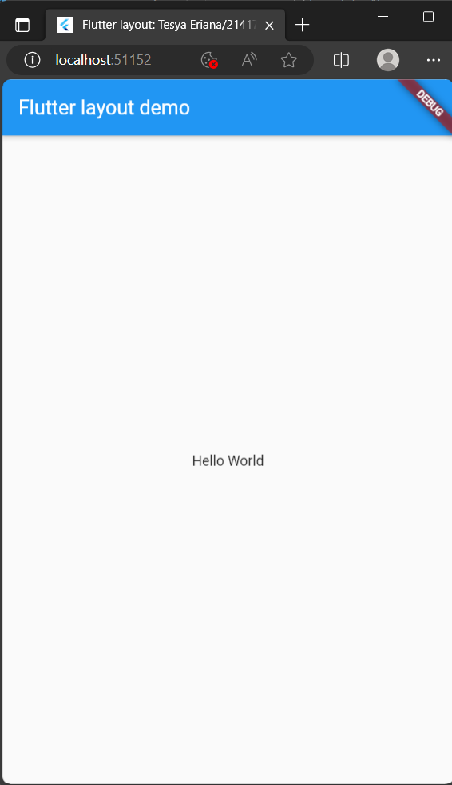
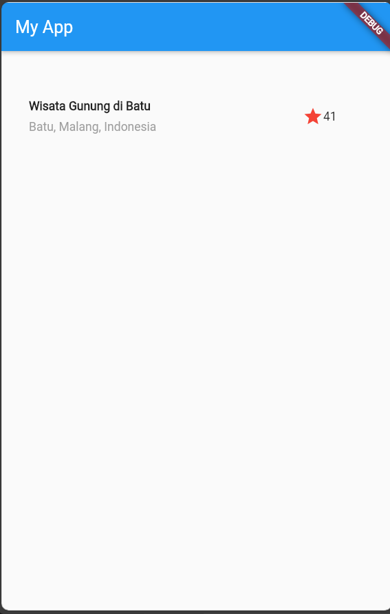
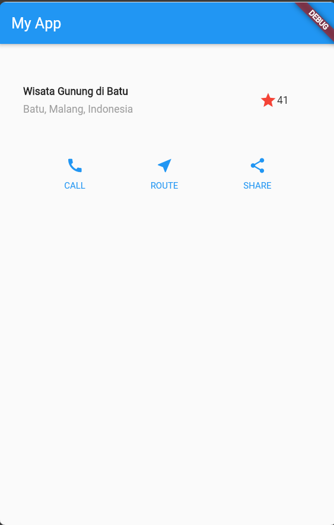
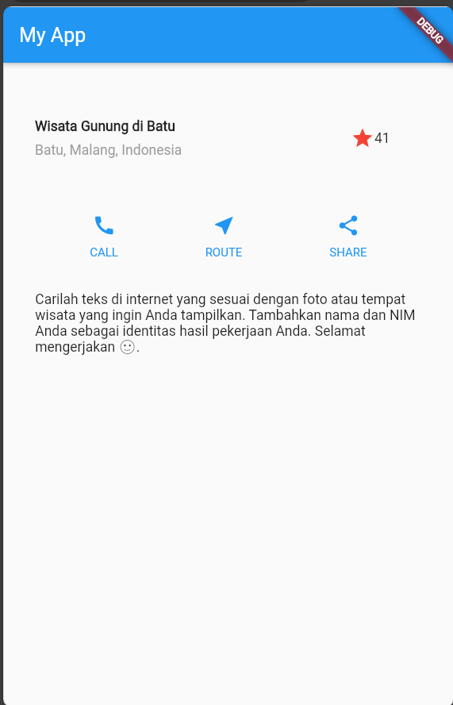
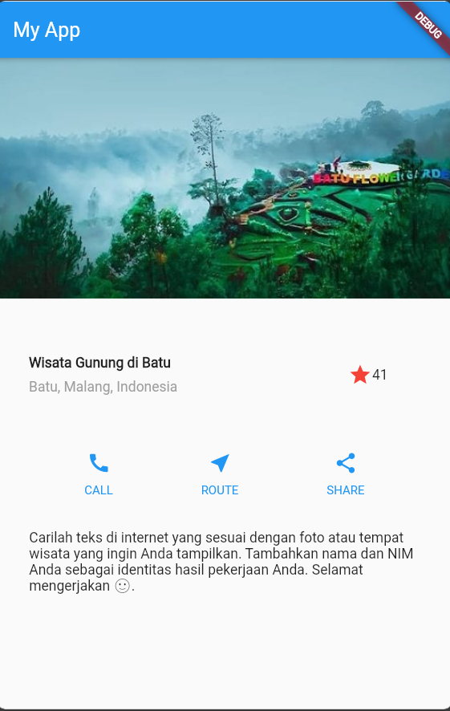

# Pertemuan 7 Layout dan Navigasi

Tesya Eriana/2141720024

## Praktikum 1 Membangun Layout di Flutter

### Langkah 2
```
import 'package:flutter/material.dart';

void main() => runApp(const MyApp());

class MyApp extends StatelessWidget {
  const MyApp({super.key});

  @override
  Widget build(BuildContext context) {
    return MaterialApp(
      title: 'Flutter layout: Nama dan NIM Anda',
      home: Scaffold(
        appBar: AppBar(
          title: const Text('Flutter layout demo'),
        ),
        body: const Center(
          child: Text('Hello World'),
        ),
      ),
    );
  }
}
```
Output :

### Langkah 4
```
Widget titleSection = Container(
    padding: const EdgeInsets.all(32.0),
    child: Row(
      children: [
        Expanded(
          /* soal 1*/
          child: Column(
            crossAxisAlignment: CrossAxisAlignment.start, // Jawaban Soal 1
            children: [
              /* soal 2*/
              Container(
                padding: const EdgeInsets.only(bottom: 8.0), // Jawaban Soal 2
                child: const Text(
                  'Wisata Gunung di Batu',
                  style: TextStyle(
                    fontWeight: FontWeight.bold,
                  ),
                ),
              ),
              Text(
                'Batu, Malang, Indonesia',
                style: TextStyle(
                  color: Colors.grey, // Menggunakan Wrana Abu-Abu
                ),
              ),
            ],
          ),
        ),
        Container(
          padding: const EdgeInsets.all(32.0), // Jawaban Soal 3
          child: Row(
            children: [
              /* soal 3*/
              Icon(
                Icons.star, // Untuk Icon Bintang
                color: Colors.red, // Menggunakan warna merah
              ),
              const Text('41'),
            ],
          ),
        ),
      ],
    ),
  );
```
Output :

## Praktikum 2 Implementasi button row

### Langkah 1: Buat method Column _buildButtonColumn
```
Column _buildButtonColumn(Color color, IconData icon, String label) {
    return Column(
      mainAxisSize: MainAxisSize.min,
      mainAxisAlignment: MainAxisAlignment.center,
      children: [
        Icon(icon, color: color),
        Container(
          margin: const EdgeInsets.only(top: 8),
          child: Text(
            label,
            style: TextStyle(
              fontSize: 12,
              fontWeight: FontWeight.w400,
              color: color,
            ),
          ),
        )
      ],
    );
  }
```
### Langkah 2: Buat widget buttonSection
```
Widget build(BuildContext context) {
    Color color = Theme.of(context).primaryColor;
    Widget buttonSection = Row(
  mainAxisAlignment: MainAxisAlignment.spaceEvenly,
  children: [
    _buildButtonColumn(color, Icons.call, 'CALL'),
    _buildButtonColumn(color, Icons.near_me, 'ROUTE'),
    _buildButtonColumn(color, Icons.share, 'SHARE'),
  ],
```

### Langkah 3: Tambah button section ke body
```
body: Column(
           children: [
             titleSection,
              buttonSection,// Digunakan untuk menampilkan section yang telat dibuat
           ],
```

Hasil Praktikum :


## Praktikum 3: Implementasi text section
### Langkah 1: Buat widget textSection
```
 Widget textSection = Container(
    padding: const EdgeInsets.all(32),
    child: const Text(
      'Carilah teks di internet yang sesuai '
      'dengan foto atau tempat wisata yang ingin '
      'Anda tampilkan. '
      'Tambahkan nama dan NIM Anda sebagai '
      'identitas hasil pekerjaan Anda. '
      'Selamat mengerjakan 🙂.',
      softWrap: true,
    ),
  );
```
### Langkah 2: Tambahkan variabel text section ke body
```
 body: Column(
          children: [
            titleSection,
            buttonSection,
            textSection, // Digunakan untuk menampilkan section yang telat dibuat
          ],
```

Hasil Praktikum



## Praktikum 4: Implementasi image section

### Langkah 1: Siapkan aset gambar
```
flutter:
  uses-material-design: true
  assets:
  - images/lake.jpg
```

### Langkah 2: Tambahkan gambar ke body
```
 children: [
            Image.asset(
              'images/lake.jpg',
              width: 600,
              height: 240,
              fit: BoxFit.cover,
            ),
```

Output :


### Langkah 3: Terakhir, ubah menjadi ListView
```
body: ListView(
          children: [
            Image.asset(
              'images/lake.jpg',
              width: 600,
              height: 240,
              fit: BoxFit.cover,
            ),
            titleSection,
            buttonSection,
            textSection, // Digunakan untuk menampilkan section yang telat dibuat
          ],
        ),
```