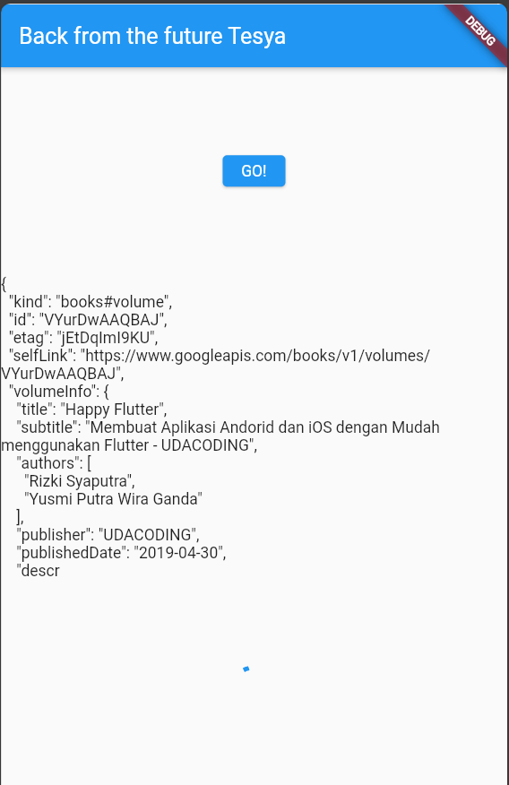

# Pemrograman Asynchronous di Flutter

A new Flutter project.

## Praktikum 1
### Soal 1
```
import 'package:flutter/material.dart';
import 'dart:async';
import 'package:flutter/material.dart';
import 'package:http/http.dart';
import 'package:http/http.dart' as http;

void main() {
  runApp(const MyApp());
}

class MyApp extends StatelessWidget {
  const MyApp({super.key});

  // This widget is the root of your application.
  @override
  Widget build(BuildContext context) {
    return MaterialApp(
      title: 'Flutter Demo',
      theme: ThemeData(
        primarySwatch: Colors.blue,
        visualDensity: VisualDensity.adaptivePlatformDensity,
      ),
      home: const FuturePage(),
    );
  }
}

class FuturePage extends StatefulWidget {
  const FuturePage({super.key});

  @override
  State<FuturePage> createState() => _FuturePageState();
}

class _FuturePageState extends State<FuturePage> {
  String result = '';
  @override
  Widget build(BuildContext context) {
    return Scaffold(
      appBar: AppBar(
        title: const Text('Back from the future Tesya'),
      ),
      body: Center(
        child: Column(
          children: [
            const Spacer(),
            ElevatedButton(
              child: const Text('GO!'),
              onPressed: () {
                
              },
            ),
            const Spacer(),
            Text(result),
            const Spacer(),
            const CircularProgressIndicator(),
            const Spacer(),
          ],
        ),
      ),
    );
  }
```
### Soal 2
```
Future<Response> getData() async {
    const authority = 'www.googleapis.com';
    const path = '/books/v1/volumes/VYurDwAAQBAJ';
    Uri url = Uri.https(authority, path);
    return http.get(url);
  }
}
```
#### W12:Soal 2


### Soal 3
```
 setState(() {});
                getData().then((value) {
                  result = value.body.toString().substring(0, 450);
                  setState(() {});
                }).catchError((_) {
                  result = 'An error occurred';
                  setState(() {});
                });
```
maksud dari kode program diatas yaitu Kode tersebut dapat diperbaiki dengan menyusun ulang logika pengambilan data dan penanganan error, serta memastikan pemanggilan setState hanya dilakukan ketika perlu untuk memastikan efisiensi dan kejelasan kode.


### Soal4
```
Future<int> returnOneAsync() async {
    await Future.delayed(const Duration(seconds: 3));
    return 1;
  }

  Future<int> returnTwoAsync() async {
    await Future.delayed(const Duration(seconds: 3));
    return 2;
  }

  Future<int> returnThreeAsync() async {
    await Future.delayed(const Duration(seconds: 3));
    return 3;
  }

  Future count() async {
    int total = 0;
    total = await returnOneAsync();
    total += await returnTwoAsync();
    total += await returnThreeAsync();
    setState(() {
      result = total.toString();
    });
  }

```
Penjelasan kode
KOde tersebut adalah bagian dari pembuatan method-method asinkron di dalam kelas _FuturePageState dalam sebuah aplikasi Flutter. Method-method returnOneAsync, returnTwoAsync, dan returnThreeAsync merupakan fungsi-fungsi yang menggunakan await untuk menunda eksekusi selama 3 detik masing-masing sebelum mengembalikan nilai berturut-turut 1, 2, dan 3. Selanjutnya, terdapat method count() yang digunakan untuk menjalankan fungsi-fungsi asinkron sebelumnya secara berurutan dan menjumlahkan hasilnya ke dalam variabel total. Method count() menggunakan await untuk menunggu hasil dari setiap fungsi asinkron sebelum melanjutkan ke fungsi berikutnya. Setelah semua nilai dikumpulkan, nilai total diubah menjadi string dan disimpan dalam variabel result. Akhirnya, setState() digunakan untuk memperbarui tampilan UI dengan nilai yang sudah dihitung.


### Soal5
```
late Completer completer;
  Future getNumber() {
    completer = Completer<int>();
    calculate();
    return completer.future;
  }

  Future calculate() async {
    await Future.delayed(const Duration(seconds: 5));
    completer.complete(42);
  }
```
Modifikasi OnPress
```
 getNumber().then((value) {
                  setState(() {
                    result = value.toString();
                  });
                });
```
Penjelasan kode
Kode tersebut menambahkan variabel completer yang digunakan untuk mengelola proses asinkron dengan menggunakan Completer. Method getNumber() bertujuan untuk menginisialisasi completer sebagai Completer<int>, kemudian memanggil method calculate() untuk melakukan penundaan selama 5 detik sebelum mengembalikan nilai 42 melalui completer.complete(42). Hasil perhitungan ini dapat diakses melalui future yang dikembalikan oleh getNumber(), sehingga memungkinkan aplikasi untuk menunggu dan mendapatkan nilai tersebut untuk digunakan di bagian lain dari kode.


### Soal6

```
Future calculate() async {
    try {
      await new Future.delayed(const Duration(seconds: 5));
      completer.complete(42);
    } catch (_) {
      completer.completeError({});
    }
  }
```
Modifikasi OnPress
```
 getNumber().then((value) {
                  setState(() {
                    result = value.toString();
                  });
                }).catchError((e) {
                  result = 'An error occurred';
                });
              },
            ),
```

Penjelasan kode
Dalam langkah kelima, perubahan dilakukan pada method calculate() di mana perubahan dilakukan pada bagian penanganan kesalahan. Sekarang, method ini menggunakan blok try-catch untuk mengelola proses asinkron. Saat proses yang tertunda dalam Future.delayed selesai, nilai 42 akan dikembalikan melalui completer.complete(42). Namun, jika terjadi kesalahan (error) selama penundaan, blok catch akan dieksekusi dan completer.completeError({}) digunakan untuk menandai bahwa terjadi kesalahan dengan mengembalikan objek kosong.
Langkah keenam mengubah bagian onPressed() di mana pemanggilan getNumber().then((value) {...}) dipindahkan ke dalam onPressed() dari tombol. Kemudian, penanganan kesalahan (error handling) ditambahkan dengan pemanggilan .catchError((e) {...}). Ketika future dari getNumber() menyelesaikan tugasnya, nilai yang diterima akan diubah menjadi string dan diperbarui ke dalam variabel result. Namun, jika ada kesalahan yang terjadi dalam proses tersebut, pesan 'An error occurred' akan disimpan dalam variabel result.


### Soal  7


### Soal 8
```
 final futures = Future.wait<int>([
      returnOneAsync(),
      returnTwoAsync(),
      returnThreeAsync(),
    ]);
  }
```
Langkah 1 menggunakan FutureGroup dari paket async untuk secara dinamis menambah dan menunggu beberapa futures sebelum menjumlahkan hasilnya. Sementara langkah 4 langsung menggunakan Future.wait dari Dart untuk menunggu sejumlah futures selesai secara bersamaan, mengumpulkan hasilnya dalam bentuk list untuk diolah.

### Soal 9


### Soal 10
```
Future handleError() async {
                try {
                  await returnError();
                } catch (error) {
                  setState(() {
                    result = error.toString();
                  });
                } finally {
                  print('Complete');
                }
              }
```


### Soal 11
```
 appBar: AppBar(
            title: const Text('Current Location Tesya')), // Prak 6 Soal 11
        body: Center(
```

### Soal 12


### Soal 13
```
return Scaffold(
        appBar: AppBar(
            title: const Text('Current Location Tesya')), // Prak 6 Soal 11
        body: Center(
          child: FutureBuilder(
              future: position,
              builder:
                  (BuildContext context, AsyncSnapshot<Position> snapshot) {
                if (snapshot.connectionState == ConnectionState.waiting) {
                  return const CircularProgressIndicator();
                } else if (snapshot.connectionState == ConnectionState.done) {
                
                return Text(snapshot.data.toString());
            } else {
              return const Text('');
                }
              }),
        ));
  }
```

### Soal 14

```
 if (snapshot.hasError) {
                   return const Text('Something terrible happened!');
                }
```
Tidak ada perbedaan


### Soal 15
```
 appBar: AppBar(
        title: const Text('Navigation First Screen Tesya'),
      ),
```
### Soal 16 
```
// Prak 8 Langkah 1
import 'package:flutter/material.dart';
import 'navigation_second.dart';

class NavigationFirst extends StatefulWidget {
  const NavigationFirst({super.key});

  @override
  State<NavigationFirst> createState() => _NavigationFirstState();
}

class _NavigationFirstState extends State<NavigationFirst> {
  Color color = Colors.blue.shade700;

  @override
  Widget build(BuildContext context) {
    return Scaffold(
      backgroundColor: color,
      appBar: AppBar(
        title: const Text('Navigation First Screen Tesya'),
      ),
      body: Center(
        child: ElevatedButton(
            child: const Text('Change Color'),
            onPressed: () {
              _navigateAndGetColor(context);
            }),
      ),
    );
  }

  // Prak 8 Langkah 3
  Future _navigateAndGetColor(BuildContext context) async {
    color = await Navigator.push(
          context,
          MaterialPageRoute(builder: (context) => const NavigationSecond()),
        ) ??
        Colors.blue;
    setState(() {});
  }
}

```
NavigationSecond
```
import 'package:flutter/material.dart';

// Prak 8 Langkah 5
class NavigationSecond extends StatefulWidget {
  const NavigationSecond({super.key});

  @override
  State<NavigationSecond> createState() => _NavigationSecondState();
}

class _NavigationSecondState extends State<NavigationSecond> {
  @override
  Widget build(BuildContext context) {
    Color color;
    return Scaffold(
      appBar: AppBar(
        title: const Text("Navigation Second Screen Tesya"),
      ),
      body: Center(
        child: Column(
          mainAxisAlignment: MainAxisAlignment.spaceEvenly,
          children: [
            const Spacer(),
            ElevatedButton(
              child: const Text("Red"),
                onPressed: () {
                  color = Colors.red.shade700;
                  Navigator.pop(context, color);
                }),
            ElevatedButton(
              child: const Text("Green"),
                onPressed: () {
                  color = Colors.green.shade700;
                  Navigator.pop(context, color);
                }),  
            ElevatedButton(
              child: const Text("Blue"),
                onPressed: () {
                  color = Colors.blue.shade700;
                  Navigator.pop(context, color);
                }),  
                const Spacer(),
          ],
        ),
      ),
    );
  }
}
```
.png)
.png)
.png)
.png)
.png)

### Soal 17

```
//Praktikum 9 Langkah 2
import 'package:flutter/material.dart';

class NavigationDialogScreen extends StatefulWidget {
  const NavigationDialogScreen({super.key});

  @override
  State<NavigationDialogScreen> createState() => _NavigationDialogScreenState();
}

class _NavigationDialogScreenState extends State<NavigationDialogScreen> {
  Color color = Colors.blue.shade700;
  @override
  Widget build(BuildContext context) {
    return Scaffold(
      backgroundColor: color,
      appBar: AppBar(
        title: const Text('Navigation Dialog Screen Tesya'),
      ),
      body: Center(
          child: ElevatedButton(
        child: const Text('Change Color'),
        onPressed: () {
          //Prak 9 Langkah 4
          _showColorDialog(context);
        },
      )),
    );
  }

  //Prak 9 Langkah 3
  _showColorDialog(BuildContext context) async {
    await showDialog(
      barrierDismissible: false,
      context: context,
      builder: (_) {
        return AlertDialog(
          title: const Text('Very important question'),
          content: const Text('Please choose a color'),
          actions: <Widget>[
            TextButton(
                child: const Text('Red'),
                onPressed: () {
                  color = Colors.red.shade700;
                  Navigator.pop(context, color);
                }),
            TextButton(
                child: const Text('Green'),
                onPressed: () {
                  color = Colors.green.shade700;
                  Navigator.pop(context, color);
                }),
            TextButton(
                child: const Text('Blue'),
                onPressed: () {
                  color = Colors.blue.shade700;
                  Navigator.pop(context, color);
                }),
          ],
        );
      },
    );
    setState(() {});
  }
}
```
.png)
.png)
.png)
.png)
