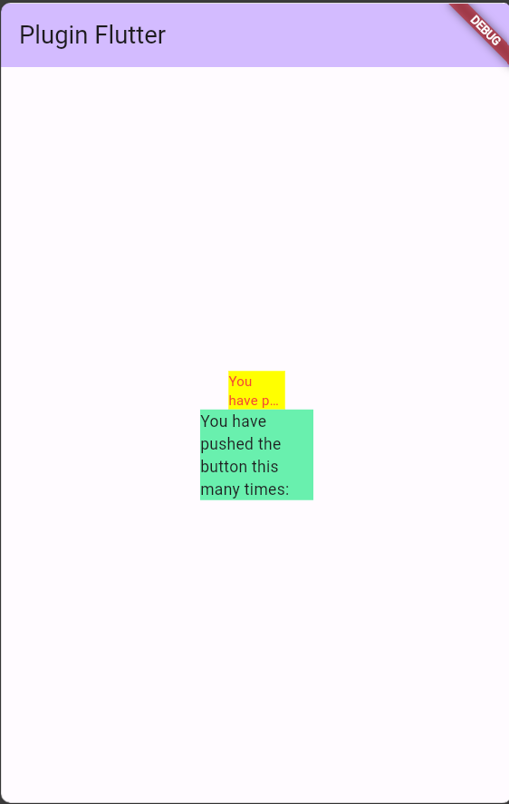

# TESYA ERIANA/28

# PLUGIN PADA FLUTTER

## LANGKAH PRAKTIKUM

### Langkah 1 
Buatlah sebuah project flutter baru dengan nama flutter_plugin_pubdev. Lalu jadikan repository di GitHub Anda dengan nama flutter_plugin_pubdev.

### Langkah 2-Menambahkan plugin auto_size_text di terminal.
```
flutter pub add auto_size_text
```

### Langkah 3-Membuat file red_text_widget.dart 
lalu mengisi dengan kode program berikut.
```
import 'package:flutter/material.dart';

class RedTextWidget extends StatelessWidget {
  const RedTextWidget({Key? key}) : super(key: key);

  @override
  Widget build(BuildContext context) {
    return Container();
  }
}
```

### Langkah 4-Menambahkan widget AutoSizeText
Masih di file red_text_widget.dart, untuk menggunakan plugin auto_size_text, ubahlah kode return Container() menjadi seperti berikut.
```
return AutoSizeText(
      text,
      style: const TextStyle(color: Colors.red, fontSize: 14),
      maxLines: 2,
      overflow: TextOverflow.ellipsis,
);
```
Penjelasan jika terdapat errr saat menambahkan kode diatas :
Akan terjadi error jika belum melakukan langkah ke 2 yaitu menambahkan plugin auto_size_text maka, tambahakan plugin tersebut untuk mengatasi error.

### Membuat Variabel text dan parameter di constructor.

```
final String text;

const RedTextWidget({Key? key, required this.text}) : super(key: key);

```

### Menambahkan widget di main.dart

```
Container(
   color: Colors.yellowAccent,
   width: 50,
   child: const RedTextWidget(
             text: 'You have pushed the button this many times:',
          ),
),
Container(
    color: Colors.greenAccent,
    width: 100,
    child: const Text(
           'You have pushed the button this many times:',
          ),
),
```

### Output 



## TUGAS PRAKTIKUM 
1. Selesaikan Praktikum tersebut, lalu dokumentasikan dan push ke repository Anda berupa screenshot hasil pekerjaan beserta penjelasannya di file README.md!
2. Jelaskan maksud dari langkah 2 pada praktikum tersebut!<br>
Jawab : <br>
Maksud dari langkah 2 pratikum yaitu menambahkan pustaka flutter dengan nama auto_size_text ke dalam proyek flutter. library ini digunakan untuk membuat teks dengan ukuran otomatis berdasar lebar kontainer atau yang lainnya. Lalu setelah menjalankan perintah tersebut di terminal library akan ditambahkan ke file 'pubspec.yaml' dan setelah itu dapat menggunakannya dalam project flutter selanjutnya.
3. Jelaskan maksud dari langkah 5 pada praktikum tersebut!<br>
Jawab : <br> maksud dari langkah 5 yaitu menambahkan variabel text bertipe data string dan memiliki kata kunci final yang artinya tidak dapat diubah setelah widget dibuat, selanjutnya terdapat konstruktor dari widget RedTexrWidget yang memiliki 2 parameter salah satunya required this.text yang berfungsi untuk mengambil nilai text yang akan ditampilkan oleh widget.
4. Pada langkah 6 terdapat dua widget yang ditambahkan, jelaskan fungsi dan perbedaannya!<br>
Jawab :<br> fungsi dari kedua widget tersebut sama yaitu untuk membuat text  dan mengelola tata letak dan dekorasi, lalu perbedaanya yaitu konstruktor nya cons RedTextWidget yaitu sebuah widget kustom yang telah dibuat pada praktikum sebelumnya terpisah dari main.dart sedangkan const Text yaitu widget bawaan flutter.
5. Jelaskan maksud dari tiap parameter yang ada di dalam plugin auto_size_text berdasarkan tautan pada dokumentasi ini !<br>
Jawab : <br>
* minFontSize : digunakan untuk mengatur ukuran teks sekecil mungkin standarnya adalah 12.
* maxFontSize : digunakan untuk mengatur teks sebesar mungkin.
* AutoSizeGroup : digunakan untuk menggabung beberapa autosizetext dalam satu grup.
* stepGranularitymenentukan seberapa besar ukuran font dikurangi setiap langkah.
* presentFontSize : digunakan untuk mendefinisikan ukuran font terlebih dahulu.
* overflowReplacement : menampilka wdget jika teks tidak sesuai batas.


